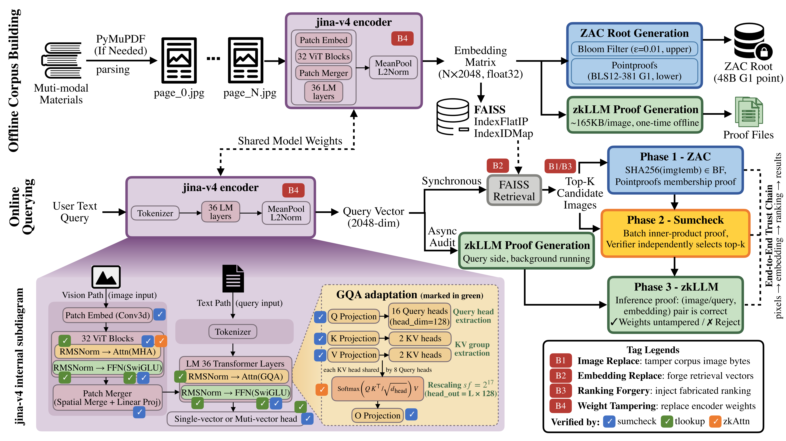

# VeriMMR：面向多模态语义数据的可验证检索机制

> 毕业设计项目 · Data-Centric Trustworthy AI

---

## 为什么需要可验证检索？

多模态 RAG 系统正在被用于医疗影像辅助诊断、法律文书检索、金融合规分析等高风险场景。但现有系统的可信性完全依赖对服务提供方的盲目信任：

- 检索到的文档**真的来自**声称的数据库吗？
- 相似度排名**真的没有**被人为调整吗？
- 向量表示**真的是**用声称的模型计算的吗？

这些问题在今天没有技术手段可以独立验证。EU AI Act（2024）对高风险 AI 系统提出可审计要求，但尚无针对检索过程的可操作规范。C2PA 等内容溯源标准证明"内容从哪来"，但无法证明"检索过程有没有被篡改"。

本项目（VeriMMR）填补这一空白：**对多模态 RAG 检索管道中每个数据流转节点施加密码学约束，使任何第三方可在不信任服务提供方的前提下独立验证检索结果的完整性。**

---

## 系统定位

本系统属于 **Data-Centric Trustworthy AI**：信任的建立不依赖对模型行为的解释（Explainability），而是对数据流中每次转换提供可独立验证的数学保障。

```
原始图像数据
    │
    │  Phase 3（zkLLM）：证明推理过程不可伪造
    ▼
向量表示（Embedding）
    │
    │  Phase 2（Sumcheck）：证明相似度计算和排名未被篡改
    ▼
检索结果（Top-k）
    │
    │  Phase 1（ZAC）：证明返回图像确实来自已承诺的语料库
    ▼
用户获得端到端可审计的检索结果
```

三个 Phase 各自对应一类攻击，覆盖从存储到计算到返回的完整攻击面：

| 攻击 | 威胁 | 防御 Phase |
|------|------|-----------|
| B1 图像替换 | 服务方用假图像替换语料库图像 | Phase 1 ZAC |
| B2 Embedding 替换 | 篡改 FAISS 中的向量以操控排名 | Phase 1 ZAC（跨层绑定） |
| B3 排名伪造 | 伪造内积分值或隐藏更高分结果 | Phase 2 Sumcheck |
| B4 权重篡改 | 替换模型权重使推理过程不可追溯 | Phase 3 zkLLM |


---

## 实验结果摘要

### 检索质量（jina-v4 零样本，4 个公开数据集）

| 数据集 | jina-v4 MRR@10 | VisRAG-Ret OOD | jina-v4 R@10 | VisRAG-Ret OOD |
|--------|:-------------:|:--------------:|:------------:|:--------------:|
| SlideVQA | **94.72** | 45.57 | **98.20** | 67.70 |
| MP-DocVQA | **79.56** | 74.60 | **94.25** | 89.65 |
| ChartQA | **87.43** | 75.99 | **93.65** | 91.40 |
| InfoVQA | **89.80** | 67.26 | **98.47** | 87.05 |

> 验证层不修改检索结果，Recall@K 在有无验证下完全相同。

### 攻击检测率

| 数据集 | B1 ZAC | B2 ZAC | B3 Sumcheck |
|--------|:------:|:------:|:-----------:|
| SlideVQA | 10/10 ✓ | 9/10 † | 50/50 ✓ |
| MP-DocVQA | 10/10 ✓ | 10/10 ✓ | 50/50 ✓ |
| ChartQA | 10/10 ✓ | 10/10 ✓ | 49/50 ‡ |
| InfoVQA | 9/10 † | 10/10 ✓ | 50/50 ✓ |

† Bloom Filter 固有假阳性（ε=0.01），大样本验证实测误报率 1.00%（800次，95% CI: [0.51%, 1.96%]）与理论值完全吻合。  
‡ 该 query 在攻击前干净索引中也未召回（检索失败掩盖攻击痕迹的边界情形）。

### 验证延迟（N=303，RTX 4090 D × 2）

| 阶段 | 延迟 | 类型 |
|------|------|------|
| jina-v4 编码 | 130 ms | 同步 |
| FAISS 检索 | <1 ms | 同步 |
| Phase 2 Sumcheck | 973 ms | 同步 |
| Phase 1 ZAC（k=5） | 4514 ms | 同步 |
| Phase 3C corpus 读取 | <1 ms | 同步（预计算） |
| **同步验证完成** | **5618 ms** | |
| Phase 3Q query proof | 30586 ms | 异步后台 |

Phase 3Q 在后台异步执行，不阻塞检索结果返回。若应用场景允许将推理证明与检索响应解耦，用户感知延迟仅增加 5.6s（1.5× 基线）。

### ZAC 扩展性（O(k) 常数证明大小）

N 从 50 增至 1000，ZAC 延迟始终稳定在 ~4.37s（证明大小 48 字节，与 N 无关）。Sumcheck 延迟随 N 线性增长（实测斜率 0.986 ≈ 1.0，O(N)）。

---

## 技术架构

### 三层验证覆盖范围

```
离线阶段（建库，一次性）
──────────────────────────────────────────────────

PDF → 图像₁…图像ₙ
         │
         ├── SHA256(imageᵢ ∥ embᵢ) → ZAC 承诺 cm（48B）   ← Phase 1 可验证来源
         │
         └── jina-v4（3.9B，ViT + LM 36层 + MeanPool）
                  ↓
              向量 v₁…vₙ（2048维）
                  │
                  ├── FAISS IndexFlatIP                    ← 精确搜索
                  └── zkLLM 证明₁…ₙ（K=5层，预计算）      ← Phase 3 推理可验证

在线阶段（每次查询）
──────────────────────────────────────────────────

用户 query → jina-v4 → 向量 q
                  │
                  ├── FAISS 搜索 → top-k 候选
                  ├── Sumcheck Global Batch（所有 N 个内积）← Phase 2 计算可验证
                  ├── ZAC.ProveM（top-k 图像成员证明）    ← Phase 1 来源可验证
                  └── Phase 3Q 后台证明 query 推理         ← Phase 3 推理可验证
```

### 密码学选型

| 组件 | 方案 | 关键性质 |
|------|------|---------|
| 语料库承诺 | ZAC = Bloom Filter + Pointproofs（BLS12-381 G₁） | O(1) 批量成员证明，证明大小与 k、N 均无关 |
| 相似度验证 | Global Batch Sumcheck（Fiat-Shamir，Mersenne 域 p=2⁶¹−1） | 单证明覆盖全部 N 个内积；Verifier 独立选 top-k |
| 推理验证 | zkLLM（Sun et al., CCS'24），Sumcheck + zkAttn + tlookup | 覆盖 FFN、Self-Attn 线性投影、GQA Softmax |
| 跨层绑定 | 承诺元素 = SHA256(image_bytes ∥ embedding_bytes) | 关闭 embedding 替换攻击路径（Phase 1 + Phase 2 接缝） |

### 与 Merkle 树的对比

ZAC 使用 Pointproofs 向量承诺，批量 k 个成员的聚合证明仅 **48 字节**，单次 pairing 验证。Merkle 树每条证明路径为 ⌈log₂N⌉ × 32 字节，k 条路径共 k × ⌈log₂N⌉ × 32 字节。N=303 时，ZAC 为 48B vs Merkle 为 1440B（k=5）。

### 多模态适配

jina-embeddings-v4 是原生多模态检索模型，文本和图像共享同一 LM 骨干（Qwen2.5-VL，36层），图像经 ViT 编码后通过 Spatial Merge 投影进入 LM，两侧路径在语言塔汇合并统一输出 2048 维 L2-norm 向量。这一架构使得同一套 ZAC + Sumcheck + zkLLM 验证机制可同时覆盖文本 query 侧和图像 corpus 侧，无需针对不同模态设计独立验证路径。

序列长度统一 padding 到 **1024 tokens**（文本路径实际约 12-25 tokens，图像路径约 641 tokens），满足 zkLLM 的 NTT 约束（seq² = 2²⁰ = 1,048,576），两侧策略完全对称。

### GQA 适配（对 zkLLM 的扩展贡献）

原版 zkLLM（Sun et al., CCS'24）仅支持标准 MHA（Multi-Head Attention）。jina-v4 的 LM 采用 **Grouped Query Attention**（16 Q头 / 2 KV头，8:1 共享比），需对 zkAttn 协议进行适配。

本项目对 `self-attn.cu` 的改动：

| 改动 | 内容 |
|------|------|
| Per-head 循环 | 替代原版广播操作，每个 Q head 独立证明 $\text{Softmax}(\mathbf{QK}^\top/\sqrt{d})\mathbf{V}$ |
| KV broadcast transpose trick | 利用 `trunc()` 将 KV head index 映射到 Q head，无需新增 CUDA kernel |
| 动态 Rescaling | 根据 `seq_len × head_dim` 自动计算整数域缩放因子，兼容任意 head 配置 |
| 参数扩展 | 新增 `argv[8]=kv_dim`、`argv[9]=num_kv_heads`，原 MHA 调用方式完全兼容 |

**验证结果（E1 实验）**：GQA zkAttn 输出与 PyTorch float32 参考实现 L∞ 误差为 **4.47×10⁻⁷**，有效 token 余弦相似度 **1.0000**，ZK proof 验证通过（rc=0）。耗时随 num_kv_heads 线性扩展（E2 实验），无额外开销。

### 差异化 K 层证明（消融实验驱动的设计决策）

对于"证明哪几层"这一问题，本项目不依赖直觉，而是通过三组系统消融实验（BI Score、残差置零、噪声注入）对全部 36 层逐层量化敏感度，发现**文本和图像模态的关键层段存在系统性差异**：

| 模态 | 关键层段 | K | 层30-32 sensitivity | 层33-35 sensitivity | 选择依据 |
|------|---------|:-:|:-------------------:|:-------------------:|---------|
| 文本 query | 层 33-35 | **3** | 0.087（边际贡献低）| 0.206 | 层30-32对文本贡献不足层33-35的一半 |
| 图像 corpus | 层 31-35 | **5** | 0.128（图像贡献显著）| 0.290 | 图像跨模态融合在更早的层开始，层31-32不可忽略 |

这一差异化策略的安全含义：攻击者若篡改图像 embedding 的计算，需要绕过最后 5 层的验证（而非 3 层）；文本 query 的轻量化证明（K=3）则将在线验证延迟从 ~45s 压缩至 ~31s，实现安全性与效率的差异化权衡。

层 33 和层 35 在文本、图像两种模态和三种实验方法中均稳定出现为最关键层，是任何策略的必选项。

---

## 信任模型

```
服务提供方（Prover）               用户 / 审计方（Verifier）
────────────────────              ────────────────────────
持有完整模型权重                     只需要公开承诺值
持有完整语料库                       ZAC Root（48B，建库后一次性发布）
运行推理，生成 proof                  模型各层权重承诺（发布一次）
随查询结果返回 proof                  接收（结果 + proof），独立验证
```

Verifier **不需要模型，也不需要语料库**——但当前实现中 Verifier 需持有 `embedding.npy` 以重建 Sumcheck 聚合向量（KZG 可消除此依赖，受限于 Python BLS12-381 运算速度暂未引入，见 `notes/implementation_log.md`）。

---

## 目录结构

```
UltraRAG/
├── script/
│   ├── interactive_demo.py          # 主 Demo（Gradio UI + 完整验证流水线）
│   ├── build_verifiable_corpus.py   # 一键建库（PDF → 语料 → embedding → 索引 → ZAC → zkLLM）
│   ├── build_corpus_zkllm_proofs.py # 语料库侧 zkLLM 证明预计算
│   ├── phase1_corpus_fingerprint.py # ZAC 语料库指纹（单独运行）
│   ├── phase2_sumcheck.py           # Sumcheck 协议测试与实验
│   ├── experiment_a1_latency.py     # 实验A1：端到端延迟分解
│   ├── experiment_a2_scalability.py # 实验A2：N 扩展性
│   ├── experiment_b_security.py     # 实验B：B1-B4 攻击检测
│   ├── experiment_c1_attack_verify.py # 实验C1：检索质量 + 攻击检测
│   ├── experiment_c2_quantization.py  # 实验C2：量化误差
│   ├── experiment_e1_gqa_correctness.py # 实验E1：GQA 正确性
│   ├── experiment_e2_gqa_overhead.py   # 实验E2：GQA 扩展性
│   ├── ablation_layer_sensitivity.py   # 消融实验：层敏感度
│   └── summarize_c1.py             # C1 结果汇总打印
├── src/
│   ├── zac/accumulator.py           # ZAC（BloomFilter + Pointproofs）
│   ├── sumcheck/inner_product.py    # Sumcheck（Global Batch 模式）
│   └── zkllm/
│       ├── self-attn.cu             # zkAttn（含 GQA 适配）
│       ├── ffn.cu / rmsnorm.cu      # FFN / RMSNorm 证明
│       ├── Makefile                 # nvcc sm_89
│       ├── load_jina_weights.py     # jina-v4 权重提取 + LoRA 合并
│       ├── fileio_utils.py          # 二进制 IO 工具
│       └── bin/                     # 编译产物（需本地 make）
├── corpora/image.jsonl              # 图像语料库索引
├── embedding/embedding.npy          # 语料库 embedding（float32, N×2048）
├── index/index.index                # FAISS IndexFlatIP
├── output/phase1/
│   ├── prover_state.json            # ZAC prover state（BF + Pointproofs CRS）
│   └── fingerprint.json             # 语料库指纹摘要（含 ZAC Root）
├── zkllm-workdir/jina-v4/
│   ├── corpus_proof_*.json          # 每张图像的 zkLLM 预计算证明
│   └── *.bin                        # jina-v4 权重承诺文件
├── notes/
│   ├── implementation_log.md        # 完整实现记录、实验分析、设计决策
│   ├── experiment_*.json            # 各组实验原始数据
│   └── figures/                     # 可视化图表
└── data/nikon.pdf                   # 示例 PDF，可通过下方链接下载
```
（注：可通过[此处](https://download.nikonimglib.com/archive4/ywJ4K00fa2Lr05vv5OS00pV5Hg36/Z7Z6UM_TH(Sc)07.pdf)下载示例PDF）

## 快速开始

### 环境配置

```bash
# 方式一：从 yml 文件还原（推荐，包含所有依赖的精确版本）
conda env create -f environment_no_builds.yml
conda activate ultrarag

# 方式二：仅还原 pip 包（跨平台时使用 environment.yml）
conda env create -f environment.yml
conda activate ultrarag
```

> `environment_no_builds.yml`：去除平台特定 build string，跨 Linux 发行版兼容性更好。  
> `environment.yml`：含完整 build string，适合与原开发环境完全对齐。

主要依赖版本：`torch 2.8.0+cu128`、`faiss-gpu`、`sentence-transformers`、`pymupdf`、`py_ecc`、`mmh3`、`gradio`

**模型路径**（默认）：
- 检索模型：`/path/to/models/jina-embeddings-v4`
- 生成模型：`/path/to/models/MiniCPM-V-4`

### 编译 zkLLM CUDA 二进制

```bash
cd /path/to/VeriMMR/src/zkllm
make all -j$(nproc)
mkdir -p bin && cp ppgen commit-param self-attn ffn rmsnorm skip-connection bin/
```

要求：CUDA ≥ 12.0，sm_89（RTX 4090）。其他 GPU 修改 Makefile 中 `ARCH`。

### 一键建库

```bash
cd /path/to/VeriMMR
python script/build_verifiable_corpus.py --pdf data/nikon.pdf
```

自动完成：PDF 切页 → jina-v4 编码 → FAISS 索引 → ZAC 指纹 → zkLLM 预计算

跳过阶段（已有数据）：
```bash
python script/build_verifiable_corpus.py --pdf data/nikon.pdf \
    --skip-corpus --skip-embed  # 只重建 ZAC 和 zkLLM
```

### 启动 Demo

```bash
python script/interactive_demo.py
# 浏览器访问 http://127.0.0.1:7860
```

---

## 应用场景

**高风险决策支持（医疗、法律、金融）**：医疗影像辅助诊断、法律文书检索、金融合规分析等场景的监管要求日趋严格。ZAC + Sumcheck 保证检索结果可追溯、不可伪造，zkLLM 保证 embedding 来自同一可信模型，使 AI 辅助决策的全过程具备可审计性，满足 EU AI Act 对高风险 AI 系统的合规要求。

**多方联合知识库（Federated RAG）**：各参与方互不信任，将 ZAC Root 存证于区块链，任意一方可独立验证其他方返回的检索结果来自约定的共同语料，Sumcheck 防止单方操控排名——在不共享原始数据的前提下实现可信联合检索。

**AI 服务知识产权保护与可审计性**：服务提供方可在**不公开模型权重**（知识产权保护）的前提下，向用户或监管机构提供推理可验证性证明——这正是 zkLLM 的核心设计动机。本系统将此能力延伸至整个检索管道，补充 C2PA 等内容溯源标准未覆盖的"检索过程"环节。

---

## 密码学原理简述

### Phase 1：ZAC 成员证明

承诺元素设计为 `SHA256(image_bytes ∥ embedding_bytes)`，同时绑定图像文件和对应向量，防止仅替换 FAISS 中向量而不改变图像的 B2 攻击。

Bloom Filter 将集合编码为二进制向量 **v**，Pointproofs（BLS12-381 G₁）对 **v** 生成 48 字节承诺根（ZAC Root）。批量成员证明通过 Fiat-Shamir 聚合为单个 G₁ 点，验证方程：

$$e(\mathtt{cm}, \textstyle\sum_{i \in \mathcal{I}} t_i \cdot g_2^{\alpha^{q+1-i}}) \stackrel{?}{=} e(\hat{\pi}, g_2) \cdot g_T^{\alpha^{q+1} \cdot \sum_i v_i t_i}$$

### Phase 2：Global Batch Sumcheck

将"全部 N 个内积均正确"转化为对聚合向量 $w = \sum_{i=1}^N \rho^i v_i$ 的单条 Sumcheck 证明（$\rho$ 由所有分值的哈希派生，Schwartz-Zippel 保证篡改以 $\geq 1 - N/p$ 概率被检测）。Verifier 持有语料向量，独立重建 $w$，从全部 N 个宣告分值中自行选 top-k，无需信任 Prover 的排名。

### Phase 3：zkLLM 推理证明

覆盖 jina-v4 LM 最后 K 层的三类操作：FFN（SwiGLU，Sumcheck + tlookup）、Self-Attn 线性投影（Sumcheck）、GQA zkAttn（整数域 Softmax，Sumcheck + tlookup）。权重由 KZG 承诺绑定——Prover 用篡改权重无法通过验证，即使不公开权重本身。

---

## 参考文献

- Dang et al., *ZAC: Efficient Zero-Knowledge Dynamic Universal Accumulator*, TPS-ISA 2022
- Sun et al., *zkLLM: Zero Knowledge Proofs for Large Language Models*, CCS 2024
- Qu et al., *zkGPT: An Efficient Non-interactive Zero-knowledge Proof Framework for LLM Inference*, EuroSys 2024
- Thaler, *Proofs, Arguments, and Zero-Knowledge*, 2022
- He et al., *VisRAG: Vision-based Retrieval-Augmented Generation on Multi-modality Documents*, ICLR 2025
- Meng et al., *ROME: Locating and Editing Factual Associations in GPT*, NeurIPS 2022
- Men et al., *ShortGPT: Layers in Large Language Models are More Redundant Than You Expect*, ACL Findings 2025
