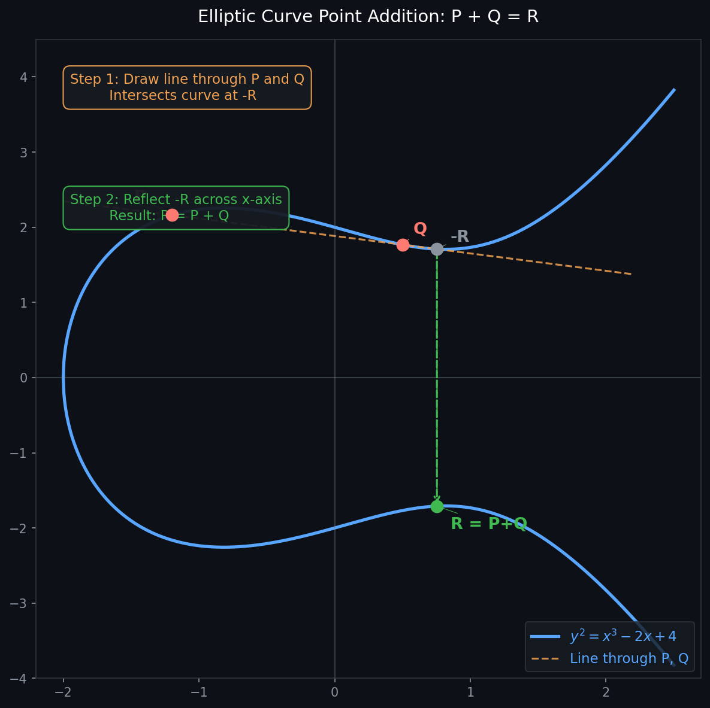

# ZAC 完整数学原理详解

> 结合论文 Dang et al. TPS-ISA 2022 与 Pointproofs (Gorbunov et al. CCS 2020)

---

## 第一部分：Bloom Filter 的数学原理

### 1.1 基本结构

Bloom Filter 用来回答一个问题：**元素 x 是否在集合 S 里？**

它的结构是一个长度为 q 的位数组，加上 k 个独立的哈希函数 h1, h2, ..., hk，每个函数把任意元素映射到 [0, q-1] 的一个位置：

$$
h_i : {0,1}* -> [0, q-1]
$$

**插入元素 s：** 计算 k 个位置，全部置 1。

$$
for\; i\; in\; 1..k:
    v[ h_i(s) ] = 1
$$

**查询元素 x：** 检查 k 个位置是否全为 1。

$$
result = AND( v[h_i(x)]\; for\; i\; in\; 1..k )
$$

- 如果有任何一个位置是 0，**确定不在集合里**（无假阴性）。
- 如果全是 1，**很可能在集合里**（有假阳性可能）。

### 1.2 假阳性率公式推导

**一个特定位置在插入 N 个元素后仍然是 0 的概率是多少？**

插入一个元素时，某个特定位置被置 1 的概率 = $k/q$（k 个哈希函数，每个命中该位置的概率是 1/q）。

所以该位置**不被**任何哈希命中的概率（一次插入）= $(1 - 1/q)^k$。

插入 N 个元素后，该位置仍然是 0 的概率：

$$
P(bit = 0) = (1 - 1/q)^{kN}
$$

利用极限近似$(1 - 1/q)^q ≈ e^{-1}$，当 q 足够大时：

$$
P(bit = 0) ≈ e^{-kN/q}
$$

**查询一个不在集合里的元素时，k 个位置全为 1（假阳性）的概率：**

$$
ε = P(false positive) = (1 - e^{-kN/q})^k
$$

这就是论文公式 (2)（对应代码里 `BloomFilter.optimal_params` 的推导基础）。

### 1.3 最优参数推导（为什么是那个公式）

**给定 N 和目标假阳性率 ε，怎么选最优的 q 和 k？**

**第一步：固定 q/N，求最优 k。**

令 $p = e^{-kN/q}$（即单个位为 0 的概率），则 $ε = (1-p)^k$。

对 k 求导令其为 0，目的是找到最优假阳性率的最小值，解得最优 k：

$$
k* = (q/N) * ln(2)
$$

代入后，最优假阳性率变为：

$$
ε = (1/2)^k = 2^{-k}
$$

**第二步：固定目标 ε，求最优 q。**

从 $k* = (q/N) * ln 2$ 代入 $ε = (1 - e^{-kN/q})^k$，令 ε 等于目标值，解出：

$$
q = -N * ln(ε) / (ln 2)^2
$$

这就是代码里的公式：

```python
# BloomFilter.optimal_params:
q = math.ceil(-N * math.log(epsilon) / (math.log(2) ** 2))
k = max(1, round((q / N) * math.log(2)))
```

**具体数字感受一下：**

```
N=10,  ε=0.01  -> q=96,  k=7   (代码测试用的参数)
N=50,  ε=0.01  -> q=479, k=7
N=200, ε=0.01  -> q=1918, k=7  (论文实验参数)
```

注意：k 几乎不随 N 变化（只依赖 q/N 的比值），q 与 N 成正比。

### 1.4 为什么 BF 是零知识的第一步

BF 只暴露向量 v，不暴露集合 S。由于哈希函数单向，从 v 反推 S 是困难的。这为后续零知识性奠定基础。

---

## 第二部分：椭圆曲线与 BLS12-381

### 2.1 椭圆曲线是什么

普通实数上的椭圆曲线 y² = x³ + ax + b，画出来长这样：
```
y |        ·
  |      ·   ·
  |    ·       ·
  |  ·           ·
  +--·-------------·-→ x
  |  ·           ·
  |    ·       ·
  |      ·   ·
  |        ·
```
关键性质：曲线上任意两点连一条线，必然交曲线于第三点（再关于 x 轴翻转），这就定义了"点加法"。
> **为什么要 mod p（有限域）**
<br>实数上的点坐标是无限精度的小数，计算机无法精确存储。
<br>把实数换成模 p 的整数（即 0, 1, 2, ..., p-1），所有运算都在这个有限集合里进行：
<br>实数版：y² = x³ + 4        坐标是任意实数
<br>有限域版：y² ≡ x³ + 4 (mod p)   坐标只能是 0 到 p-1 的整数
<br>虽然"mod p"之后曲线不再是连续图形，但点加法的代数规则完全保留，群的结构不变。

> **a=0, b=4 是怎么选的**
<br>这是人为选定的参数，选择标准是：
<br>**安全性**：离散对数问题足够难解
         <br>（攻击者无法从 k·G 反推出 k）
<br>**效率**：a=0 让点加法公式少一项乘法，计算更快
<br>**配对友好**：BLS12-381 专门为 pairing 运算设计
         <br>需要 G1、G2、GT 三个群满足特定的数学关系
<br><br>**不是推导出来的，是密码学家反复筛选、满足所有条件后"钦定"的。**

> **G1、G2、GT 三个群的来源**
<br>密码学里有一个核心需求：**配对运算（Pairing）**
<br>$e(P, Q) → R$
<br>P 在一个群里，Q 在另一个群里，R 在第三个群里
<br>配对的用途是让"乘法关系"可以被验证：
<br>**知道 k·G 但不知道 k，
<br>配对可以在不暴露 k 的情况下验证某些等式成立
<br>→ 这是 zk-SNARK 的数学基础**
<br><br>**三个群分别是什么**
<br>G1：基础曲线上的点
<br>方程：y² = x³ + 4  (mod p)
<br>坐标：普通的 mod p 整数
<br>点的大小：381 bit × 2 = 762 bit
<br>最简单，计算最快。
<br><br>G2：扭曲线上的点
<br>直接在 G1 的曲线上找不到足够多的"配对友好"的点，需要把曲线**扩展到更大的数域**：
<br>G1 的坐标在 Fp    （mod p 的整数）
<br>G2 的坐标在 Fp²   （类似复数：a + b·i，其中 a,b 是 Fp 的元素）
<br>Fp² 就是把 Fp 扩展成"二维"的数域，类比：
<br>实数 → 复数
<br>Fp  → Fp²（在 Fp 上添加一个"虚数单位"）
<br>**G2 的方程变成**：
<br>$y² = x³ + 4·(1+i)$   在 Fp² 上
<br>点的大小是 G1 的两倍（762 bit × 2）。
<br><br>**GT：乘法群**
<br>G1 和 G2 是加法群（点加法），GT 是完全不同性质的**乘法群**：
<br>GT ⊂ Fp¹²    （12维扩域里的元素）
<br>GT 里的运算是乘法，不是点加法
<br>Fp¹² 是继续扩展的结果：
<br>Fp → Fp² → Fp⁶ → Fp¹²
<br>BLS12-381 里的 "12" 就是这个扩展次数，叫做**嵌入次数（embedding degree）**。
<br><br>**三个群的关系**
<br>配对函数：e : G1 × G2 → GT
<br>性质（双线性）：
<br>$e(a·P, b·Q) = e(P, Q)^{ab}$
<br>用处：
<br>左边：知道 a·P 和 b·Q，不知道 a 和 b
<br>右边：仍然能验证 ab 的关系
<br>→ 在不暴露秘密的情况下验证乘法关系


> **p 那串大数是怎么来的**
<br>p 需要满足几个条件：
<br>1. 是素数          → 保证 mod p 构成域（除法有意义）
<br>2. 约 381 位       → 安全强度约 128 bit（攻击需要 2¹²⁸ 次运算）
<br>3. 满足配对条件    → 12 · (p-1) 能被曲线的阶整除（技术要求）
<br>4. 有高效算法      → 特殊的位模式让模运算更快
<br><br>这个具体的 p 值是 2017 年由 Sean Bowe 等人设计 BLS12-381 时，通过计算机搜索找到的——在满足所有条件的素数里选了一个计算最高效的。

椭圆曲线不是椭圆，而是满足方程的点集：
$$
y^2 = x^3 + ax + b  （mod p）
$$

BLS12-381 的 G1 曲线方程（a=0, b=4）：

$$
y^2 = x^3 + 4  （mod p）
$$

其中 p 是一个 381 位的素数：

$$
p = 0x1a0111ea397fe69a4b1ba7b6434bacd764774b84f38512bf6730d2a0f6b0f6241eabfffeb153ffffb9feffffffffaaab
$$

曲线上的点加法满足特殊的几何规则（切线和割线法则），构成一个**加法群**，记为 G1。

### 2.2 离散对数难题（安全基础）

在群 G1 里，给定生成元 g 和点 $P = g^k$（即 k 次点加法），**从 P 反推 k 在计算上是不可行的**，这就是椭圆曲线离散对数问题（ECDLP）。

这意味着：


> 知道 $g^{alpha}$ 和 $g^{(alpha^2)}$ 等，但不知道 alpha 本身
<br>-> 无法从承诺 $C = g^{(v_1*alpha + v_2*alpha^2 + ...)}$ 推出任何 $v_i$ 的信息

> **离散对数难题**
<br>普通版本（有限域）
<br>已知 $g、p、g^x mod p$，求 $x$。
<br>正向计算很容易：
<br>给定 $x=50$，计算 $g^{50} mod\,p$，直接算就行。
<br>反向却极难：
<br>给定结果 $y$，求 $x$ 满足 $g^x ≡ y (mod\,p)$，
<br>唯一的办法接近于逐一枚举，而 x 是个 300 位的数，宇宙年龄内算不完。
<br><br>椭圆曲线版本
<br>把"乘法"换成椭圆曲线上的"点加法"：
<br>已知基点 g 和结果点 $Y = x·g$，求 x。
<br>正向：$x·g = g+g+g...+g$（x次），用快速算法很高效。
<br>反向：知道起点 g 和终点 Y，问走了几步——没有高效算法，比有限域版本更难。
<br><br>本质是什么
<br>难题的本质是**单向性**：
<br>- 某种运算正向做很容易
<br>- 但反向推导在数学上没有捷径
<br>- 不是"暂时没人会"，而是目前证明不存在多项式时间算法
<br><br>**KZG 承诺、椭圆曲线签名、ECDH 密钥交换，
<br>所有这些密码学方案的安全性，最终都建立在这个难题上。**


### 2.3 为什么选 BLS12-381

BLS12-381 有三个群 G1, G2, GT，满足双线性配对：

$$
e: G2 × G1 -> GT
$$

性质（双线性映射的核心）：

$$
e(a*P, b*Q) = e(P, Q)^{ab} \quad 对任意 a,b \; in \; Z_p
$$

BLS12-381 的参数选取满足：
- **128 位安全级别**：攻击者需要 $2^{128}$ 次运算
- **G1 点压缩大小 = 48 字节**（$381 / 8$ = 47.6 字节，向上取整）
- **G2 点压缩大小 = 96 字节**（两个 381 位坐标）
- **配对友好**：专门为配对运算优化的参数

G1 压缩 48 字节 = 论文里"proof size = 48 bytes"的直接来源。

代码里的对应：

```python
from py_ecc.optimized_bls12_381 import G1, G2, pairing, curve_order
# G1: (FQ, FQ, FQ)      <- 三个 381-bit 域元素（projective 坐标）
# G2: (FQ2, FQ2, FQ2)   <- 三个 FQ2 元素（G2 在 Fp^2 上）
# pairing(Q: G2, P: G1) -> FQ12   <- 注意 G2 在前
```

> **椭圆曲线上的基础性质**
<br>曲线上的点满足**点加法**（前面讲的几何构造），由此可以做标量乘法：
<br>$a*P = P + P + P + ... （a次）$
<br>这是整个密码学的基础：正向算很快，反向（离散对数）不可能。
<br><br>**双线性配对是什么**
<br>普通椭圆曲线只有加法，无法做"乘法"。
<br>配对是一个额外的数学工具，把两个曲线上的点"映射"成一个域元素：
<br>$e: G2 × G1 → GT$
<br>关键性质（双线性）：
<br>$e(a*P, b*Q) = e(P, Q)^{(ab)}$
<br>意思是：**标量可以"穿越"配对**，乘法关系在映射后保持。
<br>这让验证者可以在不知道 α 的情况下验证等式是否成立——
<br>两边用配对展开后，因为双线性性质相等。
<br>G1 和 G2 分开是因为配对需要两个"不同来源"的群，
<br>否则双线性性质会退化，产生安全漏洞。
<br><br>**压缩大小怎么来的**
<br>椭圆曲线上一个点有 (x, y) 两个坐标，但 y 可以从 x 推出来：
<br>$y² = x³ + 4   →   y = ±√(右边)$
<br>所以只存 x，再用 1 个 bit 记录 y 的正负，就能恢复完整的点。
<br>- G1：x 是 381-bit → 48 字节（381/8 向上取整）
<br>- G2：x 是 Fp² 元素（两个 381-bit）→ 96 字节 ($x = (a + b·i)$   ←  复数形式，a 和 b 各 381-bit)
<br>KZG 证明 π 就是一个 G1 点，所以 **proof size = 48 bytes**。
<br><br>**为什么用 Projective 坐标（三个分量）**
<br>点加法的斜率公式有除法，在有限域里除法 = 求模逆元，很贵。
<br>Projective 坐标用 (X, Y, Z) 表示 (X/Z, Y/Z)，
<br>把除法推迟到最后一步，中间全部用乘法，大幅提升性能。
<br>存储和传输时再转回两个坐标的压缩形式。

---

## 第三部分：Pointproofs 的数学原理

### 3.1 KZG 承诺的直觉（Pointproofs 的祖先）

先理解更简单的 KZG 多项式承诺。

有一个多项式 $f(x) = v_1*x + v_2*x^2 + ... + v_{q-1}*x^{q-1}$。
> 整个流程的意义
<br>向量 → 插值 → f(x) → 承诺 C
<br>&nbsp;&nbsp;&nbsp;&nbsp;&nbsp;&nbsp;&nbsp;&nbsp;&nbsp;&nbsp;&nbsp;&nbsp;&nbsp;&nbsp;&nbsp;&nbsp;&nbsp;&nbsp;&nbsp;&nbsp;&nbsp;&nbsp;&nbsp;&nbsp;&nbsp;&nbsp;&nbsp;&nbsp;&nbsp;&nbsp;&nbsp;&nbsp;&nbsp;&nbsp;&nbsp;&nbsp;&nbsp;&nbsp;&nbsp;&nbsp;&nbsp;&nbsp;&nbsp;&nbsp;↓
<br>验证者问：f(i) = ?
<br>证明者答：vᵢ，附上证明 π
<br>验证者：配对检验通过，相信 f(i) = vᵢ
<br>**KZG 证明的作用是：让验证者相信证明者没有在 f(i) 的值上撒谎，而不是证明 f(i) = vᵢ 这件事本身。**

承诺 = 用 alpha 代入但不暴露 alpha：

$$
C = g^{f(alpha)} = g^{v_1*alpha + v_2*alpha^2 + ... + v_{q-1}*alpha^{q-1}}
$$

由于 $CRS = (g^{alpha}, g^{alpha^2}, ..., g^{alpha^{q-1}})$ 已公开，任何人都可以计算这个承诺，但没人知道 alpha 是什么。

**证明 f(i) = vi（即向量第 i 个位置的值）：**

多项式除法：如果 $f(i) = v_i$，那么 $(f(x) - v_i)$ 一定能被 $(x - i)$ 整除：

$$
f(x) - v_i = (x - i) * q(x)     \quad q(x) 是商多项式
$$

> 因为 `i` 是 `f(x) - vᵢ` 的根。
<br>**因式定理**
<br>代入 x = i：
<br>$f(i) - vᵢ = vᵢ - vᵢ = 0$
<br>所以 `i` 是多项式 `f(x) - vᵢ` 的一个根。
<br><br>**因式定理说**：如果 `x = i` 是多项式 `g(x)` 的根，则 `(x - i)` 整除 `g(x)`。
<br>**为什么因式定理成立**
<br>对任意多项式 `g(x)`，做多项式除法：
<br>$g(x) = (x - i) · q(x) + r$
<br>其中余数 `r` 是常数（因为除数是一次式，余数次数必须更低）。
<br>代入 x = i：
<br>$g(i) = 0 · q(i) + r = r$
<br>如果 `g(i) = 0`，则 `r = 0`，所以：
<br>$g(x) = (x - i) · q(x)$
<br>即 `(x - i)` 整除 `g(x)`。
<br><br>套回原式：`g(x) = f(x) - vᵢ`，`g(i) = 0`，所以 `(x - i)` 整除 `(f(x) - vᵢ)`。

证明就是 $g^{q(alpha)}$（同样用 CRS 计算），验证方用配对检验：

$$
e( g^{q(alpha)}, g^{alpha-i} ) =? e( C / g^{vi}, g )
$$
> 证明者想证明："我知道一个多项式 f(x)，且 f(i) = vᵢ"，但不暴露整个 f(x)。
<br><br>**第一步：承诺**
<br>证明者先提交承诺：
<br>$C = g^{(f(α))}$
<br>这相当于"锁住"了 f(x)，之后不能改。
<br><br>**第二步：证明者构造证明**
<br>由因式定理，$f(i) = vᵢ$ 成立时：
<br>$f(x) - vᵢ = (x - i) · q(x)$
<br>证明者计算商多项式 $q(x)$，然后用 CRS 计算：
<br>$π = g^{(q(α))}$
<br>把 π 发给验证者。
<br><br>**第三步：验证者检验**
<br>验证者要确认等式：
<br>$f(α) - vᵢ = (α - i) · q(α)$
<br>但验证者不知道 α，所以不能直接算。
<br>这时用配对把等式"搬"到指数上检验：
<br>左边：$e(g^{q(α)},  g^{(α-i)})  = e(g,g)^{( q(α)·(α-i) )}$
<br>右边：$e(C/g^vᵢ, g) = e(g^{(f(α)-vᵢ)}, g) = e(g,g)^{( f(α)-vᵢ )}$
<br>如果 $f(α) - vᵢ = (α-i)·q(α)$ 成立，两边相等。 
<br>逻辑链总结
<br>$f(i) = vᵢ$
<br>&nbsp;&nbsp;&nbsp;↓ 因式定理
<br>$f(x) - vᵢ = (x-i)·q(x)$
<br>&nbsp;&nbsp;&nbsp;↓ 代入 x=α
<br>$f(α) - vᵢ = (α-i)·q(α)$
<br>&nbsp;&nbsp;&nbsp;↓ 两边放到指数上，用配对验证
<br>$e(g^{q(α)}, g^{(α-i)}) = e(C/g^vᵢ, g)$
<br>验证者只需要检验最后这个配对等式，不需要知道 α 和 f(x) 本身。
<br><br>**为什么伪造不了**
<br>如果 $f(i) ≠ vᵢ$，则 $f(α) - vᵢ ≠ (α-i)·q(α)$，无论证明者怎么构造 q(x)，配对等式都不成立。伪造合法的 π 等价于解离散对数，计算上不可能。

**Pointproofs 把这个思路推广到"向量承诺 + 聚合"。**

### 3.2 Pointproofs CRS 的含义

论文 Appendix 给出的 CRS（代码里 `_setup` 方法）：

```python
# 秘密选 alpha in Z_p，然后计算：
P[i-1]  = g1^{alpha^i}          i = 1, 2, ..., q        (共 q 个 G1 点)
Px[j]   = g1^{alpha^{q+2+j}}    j = 0, 1, ..., q-2      (共 q-1 个 G1 点，证明里有两个多项式相乘，次数叠加：f(x) · g(x)   最高次可达 2q
所以需要更高次幂的 CRS 点，Px 就是专门覆盖 q+2 到 2q 这段的。)
V[i-1]  = g2^{alpha^i}          i = 1, 2, ..., q        (共 q 个 G2 点)
gT_aq1  = e(g2^{alpha^q}, g1^alpha)  = gT^{alpha^{q+1}}  (GT 中的一个值，预计算一个 GT 里的值，因为 α^(q+1) 次幂超出了 CRS 的范围，无法用普通方法算，所以提前用配对算好存起来。)
```

注意：$alpha^{q+1}$ 故意不放在 CRS 里，这是安全性的关键——如果有人能计算 $g_1^{alpha^{q+1}}$，就能伪造证明。
> 因为 $α^{(q+1)}$ 这个幂次刚好"卡在中间"，CRS 里有 $α^q$ 和 $α^1$，但就是没有 $α^{(q+1)}$。
<br>**CRS 的范围**
<br>P  覆盖：α¹, α², ..., αq
<br>Px 覆盖：α^(q+2), α^(q+3), ..., α^(2q)
<br>注意：**`α^(q+1)` 被故意跳过了**，两段之间有一个空洞。
<br><br>**为什么故意跳过**
<br>这是安全设计。如果 CRS 里有连续的 `α^1` 到 `α^(2q)`，攻击者可以构造某些特殊多项式绕过证明系统的安全性（具体是 **d-PKE 假设**要求这个空洞存在）。
<br><br>**但验证时偏偏需要它**
<br>某个验证等式里需要用到 $gT^{(α^{(q+1)})}$，不能没有。
<br>解决办法：用配对"拼"出来：
<br>$e(g_2^{(α^q)}, g_1^α) = g_T^{(α^q · α)} = g_T^{(α^{(q+1)})}$
<br>CRS 里有 `g2^(α^q)`（V 数组最后一个）和 `g1^α`（P 数组第一个），两个一配对就得到了。
<br><br>只需要算**一个**，因为整个系统里只有这一个幂次落在空洞里，其他的要么在 P/Px 范围内可以直接取，要么可以通过点加法组合出来。

```python
# 代码里：
def _setup(self, alpha):
    a = [0] * (2*q + 2)
    a[1] = alpha % p
    for i in range(2, 2*q+2):
        a[i] = (a[i-1] * alpha) % p       # a[i] = alpha^i mod p

    self._P  = [multiply(G1, a[i]) for i in range(1, q+1)]   # g1^{alpha^i}
    self._Px = [multiply(G1, a[q+2+j]) for j in range(q-1)]  # g1^{alpha^{q+2+j}}
    self._V  = [multiply(G2, a[i]) for i in range(1, q+1)]   # g2^{alpha^i}
    self._gT_aq1 = pairing(self._V[q-1], self._P[0])         # e(g2^{alpha^q}, g1^alpha)
```

### 3.3 Commit 的数学

向量 $m = (m_1, ..., m_{q-1})$，随机数 r（隐藏 m 的信息，hiding 性质）。

承诺公式（论文 Appendix，PR.Commit）：

$$
C = g_1^{ r*alpha^q + \sum_{i=1}^{q-1} m_i * alpha^i } \qquad 定义承诺的原始形式\\
  \qquad\qquad\;= (g_1^{alpha^q})^r * \prod_{i=1}^{q-1} (g_1^{alpha^i})^{m_i}\qquad\; 利用指数运算法则拆开\\
  \quad\quad\;\,\,= P[q-1]^r * \prod_{i} P[i-1]^{m_i}\qquad 替换成公开参数 P[i]
$$

代码：

```python
def commit(self, m, r):
    C = multiply(self._P[q-1], r)         # P[q-1]^r = g1^{r*alpha^q}
    for i, val in enumerate(m[:q-1]):
        if val != 0:
            C = add(C, multiply(self._P[i], val))   # += P[i]^mi，注意这里指的是加法群，add是加法群记法
    return C
```

**为什么加随机数 r？**
如果没有 r，对于二进制向量 $m\; in\; \{{0,1}\}^{q-1}$，由于组合数有限，
攻击者可以枚举所有可能的 m，算出对应承诺，通过比对找到真正的 m。
加上随机数 r 后，承诺在统计上与均匀随机 G1 点不可区分，实现**完美隐藏（hiding）**。

### 3.4 Prove 的数学

**证明位置 i 的值是 $m_i$。**

定义 $m' = (m_1, ..., m_{q-1}, r)$（长度 $q$，最后一位是随机数，证明者在不暴露其他 $m_j​（j \neq i）和\; r$ 的情况下，让验证者相信——
生成 $C$ 时用的消息，第 $i$ 位就是 $m_i$）。

单个证明（论文 Appendix，PR.Prove）：

$$
\pi_i = g_1^{ \sum_{j\, in\, [q],\, j!=i} m'_j * alpha^{q+1-i+j} }
$$

```
可信设置（一次性）
  └── alpha（秘密，永久销毁）
  └── P[0], P[1], ..., P[2q]  ← 公开参数，g_1^{alpha^i}

证明者持有
  └── m = (m1, ..., m_{q-1})  ← 消息
  └── r                        ← 随机盲化数
  └── m' = (m1,...,m_{q-1}, r) ← 拼起来方便统一表达

公开给所有人
  └── C                        ← 承诺（一个群元素）

证明某个位置时
  └── i                        ← 要证明的位置
  └── m_i                      ← 该位置的值（声称）
  └── π_i                      ← 对应的证明（一个群元素）
```

为什么这个指数 $q+1-i+j$ 看起来奇怪？这是 Pointproofs 的核心技巧：

**直觉：** 证明是承诺"去掉位置 i 的贡献"之后的残差。验证时，配对方程会对消掉 i 的部分，留下的等式恰好验证 mi 的正确性。
> **先看验证方程的需求**
<br>验证时用双线性配对，大致需要：
<br>$e(\pi_i, g_2^{\alpha^i}) \stackrel{?}{=} e(C / g_1^{m_i \cdot \alpha^q},\ g_2)\ \cdot\ \ldots$
<br>配对的本质是：两边指数相乘后要能"对消"，所以证明的指数 + 验证用的指数 必须凑成一个固定次数的幂。
<br><br>**看指数 $q+1−i+j$ 的结构**
<br>验证位置 $i$ 时，用 $g_2^{\alpha^i}$​ 去配对 $\pi_i$​，两者指数相乘：
<br>$\underbrace{(q+1-i+j)}_{\pi_i \text{ 的指数}} + \underbrace{i}_{\text{验证用}} = q+1+j$
<br>$i​​=q+1+j$
对所有 $j \in [q]$ 且 $j \neq i$，结果是 $q+1+j$，
与 $i$ 无关！
<br>这样验证方程左边的指数形式对所有位置都统一，可以和承诺 $C$（指数是$\alpha^j$的线性组合）正确对消。
<br>**$C$ 是固定的，验证方程必须对所有 $i$ 都能用同一个 $C$ 来对消，所以指数里的 $i$ 必须消掉。**

代码：

```python
def prove(self, pos, m, r):
    i = pos + 1                            # 转为 1-indexed
    m_prime = list(m[:q-1]) + [r]         # 长度 q
    pi = Z1                                # G1 零元
    for j in range(1, q+1):
        if j == i:
            continue
        exp = q + 1 - i + j               # alpha 的幂次
        if exp == q + 1:
            continue                       # 故意跳过，不在 CRS 里
        if m_prime[j-1] == 0:
            continue
        pi = add(pi, multiply(self._g1_alpha_i(exp), m_prime[j-1]))
    return pi
```

### 3.5 Aggregate 的数学（Fiat-Shamir 变换）

**问题：** 要证明位置集合 I = {i1, i2, ..., ik} 的值全正确，
直接发 k 个证明需要 k*48 字节，随 |I| 增大。

**解决：** 用 Fiat-Shamir 变换把 k 个证明聚合成一个。

对每个位置 i，计算一个随机挑战数：

```
ti = H'(i, C, I, m[I])    <- 对承诺、位置集合、值取哈希，得到 Z_p 中的数
```

聚合证明：

```
pi_hat = prod_{i in I} pi_i^{ti}   <- 在 G1 中加权求和
       = sum_{i in I} ti * pi_i    <- 因为 G1 是加法群，"乘方"对应"标量乘"
```

代码：

```python
def aggregate(self, C, I, v_I, proofs):
    agg = Z1
    for pos, pi in zip(I, proofs):
        t = self._challenge(pos, C, I, v_I)   # ti = H'(...)
        agg = add(agg, multiply(pi, t))        # agg += pi_i * ti
    return agg
```

**为什么聚合是安全的？**
Fiat-Shamir 变换将交互式协议转为非交互式。挑战数 ti 依赖于承诺 C 和所有要证明的值，攻击者无法预先选择 ti 来构造假证明（随机预言机模型下可证安全）。

### 3.6 Verify 的数学（配对方程为什么成立）

验证等式（论文 Appendix，PR.Verify）：

$$
e\!\left(C,\; \sum_{i \in I} t_i \cdot g_2^{\alpha^{q+1-i}}\right)
\;=\;
e(\hat{\pi},\; g_2) \;\cdot\; g_T^{\,\alpha^{q+1} \cdot \sum_{i \in I} m_i t_i}
$$

**展开左边：**

$$C = g_1^{\,\sum_j m'_j \cdot \alpha^j}$$

$$\sum_{i \in I} t_i \cdot g_2^{\alpha^{q+1-i}} = g_2^{\,\sum_i t_i \cdot \alpha^{q+1-i}}$$

利用双线性 $e(g_1^a,\, g_2^b) = e(g_1, g_2)^{ab}$，得：

$$\text{LHS} = e(g_1, g_2)^{\left(\sum_j m'_j \cdot \alpha^j\right)\left(\sum_i t_i \cdot \alpha^{q+1-i}\right)}
= e(g_1, g_2)^{\,\sum_{i,j}\, m'_j \cdot t_i \cdot \alpha^{j+q+1-i}}$$

**展开右边：**

$$\hat{\pi} = \sum_{i \in I} t_i \cdot \pi_i
= \sum_{i \in I} t_i \cdot g_1^{\,\sum_{j \neq i} m'_j \cdot \alpha^{q+1-i+j}}
= g_1^{\,\sum_{i \in I}\sum_{j \neq i} t_i \cdot m'_j \cdot \alpha^{q+1-i+j}}$$

$$e(\hat{\pi},\, g_2) = e(g_1, g_2)^{\,\sum_{i,j:\, j \neq i} t_i \cdot m'_j \cdot \alpha^{q+1-i+j}}$$

$$g_T^{\,\alpha^{q+1} \cdot \sum_i m_i t_i}
= e(g_1, g_2)^{\,\alpha^{q+1} \cdot \sum_{i \in I} m_i t_i}
= e(g_1, g_2)^{\,\sum_{i \in I} m'_i \cdot t_i \cdot \alpha^{q+1}}
= e(g_1, g_2)^{\,\sum_{i \in I} m'_i \cdot t_i \cdot \alpha^{q+1-i+i}} \quad (j=i \text{ 的项})$$

**关键对消：** LHS 里 $j=i$ 的项恰好就是右边 $g_T$ 那部分，$j \neq i$ 的项就是 $e(\hat{\pi}, g_2)$ 那部分。

```
LHS = (j!=i 的项) + (j=i 的项)
    = e(pi_hat, g2) * gT^{...}
    = RHS  ✓
```

这就是为什么等式成立。

代码：

```python
def verify(self, C, I, v_I, pi_hat):
    t_vals = [self._challenge(pos, C, I, v_I) for pos in I]

    # LHS: e( sum_i ti*g2^{alpha^{q-pos}}, C )
    V_sum = Z2
    for pos, t in zip(I, t_vals):
        exp = self.q - pos             # alpha^{q+1-(pos+1)} = alpha^{q-pos}
        if 1 <= exp <= self.q:
            V_sum = add(V_sum, multiply(self._V[exp-1], t))
    lhs = pairing(V_sum, C)           # pairing(G2, G1) -> GT

    # RHS: e(g2, pi_hat) * gT^{sum vi*ti}
    exp_sum = sum(v * t for v, t in zip(v_I, t_vals)) % curve_order
    rhs = pairing(G2, pi_hat) * (self._gT_aq1 ** exp_sum)

    return lhs == rhs
```

**注意代码里 v_I 全为 1（成员证明时）：**

在 ZAC.VerifyM 里，验证方并不知道原始 BF 向量，只知道查询集 S_hat 对应的位置 I 应该全为 1（如果 S_hat 是 S 的子集的话）：

```python
# ZACAccumulator.verify_membership:
v_I = [1] * len(I)    # 声称这些位置全为 1
```

如果原始 BF 向量在这些位置有任何 0，配对方程就不会成立，验证失败。

---

## 第四部分：ZAC = BF + Pointproofs 的组合

### 4.1 ZAC.Com 的完整逻辑

```
输入：集合 S = {s1, s2, ..., sN}

Step 1: v = BF.Gen(S)
        用 k 个哈希函数把 S 映射为 {0,1}^q 的位向量

Step 2: cm = PR.Commit(v, r)
        用 Pointproofs 承诺这个位向量，得到一个 G1 点

输出：cm  (48 字节)
```

代码：

```python
def __init__(self, S, ...):
    self._bf = BloomFilter.optimal_params(N, epsilon)
    self._v  = self._bf.gen(set(S))           # S -> {0,1}^q
    self._r  = _random_zp()
    self._pr = Pointproofs(q=self._bf.q, ...)
    self._cm = self._pr.commit(self._v, self._r)   # -> 48字节 G1 点
```

### 4.2 ZAC.ProveM 的完整逻辑

```
输入：集合 S，查询子集 S_hat = {x}（单个元素）

Step 1: I = BF.membership_indices({x})
        I = { h1(x), h2(x), ..., hk(x) }   <- x 在 BF 中对应的位置

Step 2: v_I = [v[i] for i in I]
        取出这些位置的值（都应该是 1，如果 x in S）

Step 3: 对每个 i in I，计算单个证明 pi_i = PR.Prove(i, v, r)

Step 4: pi_hat = PR.Aggregate(cm, I, v_I, {pi_i})
        把所有单个证明聚合成一个 G1 点

输出：pi_hat  (48 字节)
```

### 4.3 ZAC.VerifyM 的完整逻辑

```
输入：承诺 cm，查询元素 x，证明 pi_hat

Step 1: I = BF.membership_indices({x})
        验证方自己计算 x 在 BF 中的位置（BF 参数公开）

Step 2: v_I = [1, 1, ..., 1]（共 |I| 个）
        声称：x in S <=> BF 中这些位置全为 1

Step 3: PR.Verify(cm, I, v_I, pi_hat)
        跑配对方程，检验证明是否有效

输出：True / False
```

**零知识性的来源：**
验证方只看到 cm（G1 点）和 pi_hat（G1 点），
而 cm = g1^{r*alpha^q + f(alpha)} 由于随机数 r 的存在，在统计上完全随机，
无法从 cm 推出任何关于 S 的信息。这就是 ZAC 的零知识性。

### 4.4 非成员证明：Bloom Filter 的角色

**为什么非成员证明几乎不额外增加开销？**（论文中 ZAC 的一大优势）

证明 x 不在 S 里，就是找到一个位置 pos，使得：

```
h_l(x) = pos，但 v[pos] = 0
```

也就是 BF 对 x 的某个哈希位置实际上是 0，说明 x 一定不在 S 里（BF 无假阴性）。

```python
# ZAC.ProveN（论文算法）：
pi = ProveM(cm, S, S_hat, r)     # 先生成成员证明（即使 x 不在 S 里）
x = { pos for pos in I if v[pos] == 0 }   # 找出为 0 的位置
pi_hat = (pi, x)                  # 非成员证明 = 成员证明 + 一个位置索引
```

非成员验证：

```python
# ZAC.VerifyN：
(pi, x) = pi_hat
I = BF.membership_indices(S_hat)
v' = [1 for i in I if i != x[0]] + [0 for x_pos in x]   # 声称 x 位置是 0
b = PR.Verify(cm, I, v', pi)       # 配对检验
return x != {} and b              # 存在为 0 的位置 && 证明有效
```

代价：**只比成员证明多一个位置索引**（4 字节整数），这就是论文说"非成员证明复杂度与成员证明相当"的原因。

---

## 第五部分：参数设计与实际权衡

### 5.1 q 的大小决定一切

q 是 BF 位向量长度，同时也是 Pointproofs 向量长度，直接决定：

| q 增大的影响 | 说明 |
|-------------|------|
| BF 假阳性率下降 | 更准确，但 q 越大越好 |
| CRS 大小增大 | O(q) 个 G1/G2 点 |
| 证明生成变慢 | 需要计算 O(q) 次点乘 |
| 验证速度基本不变 | 只有 2 次配对，O(1) |

所以 ZAC 的权衡是：**把计算开销转移到证明方（离线），验证方永远 O(1)**。

### 5.2 论文的实验参数

```
N = 200 (上界集合大小)
ε = 0.01 (1% 假阳性率)
-> q = 1918, k = 7

硬件：2x AMD EPYC 7452, 8GB RAM
实现：Rust + Pointproofs 库

Com 时间：约 1.86s（主要是 PR.Commit，BF.Gen 可忽略）
ProveM（|S_hat|=1）：约 13-15s
VerifyM（|S_hat|=1）：约 100-400ms
```

注意：论文用的是 Rust 实现，我们的 py_ecc 实现会慢 50-100 倍。

### 5.3 代码里的参数与论文参数对比

```python
# 测试用参数（代码里的单元测试）：
N=5,  ε=0.01 -> q=48,  k=7    # 极小，用于快速验证正确性，~秒级

# 真实语料库参数（以 nikon.pdf 约 50 页为例）：
N=50, ε=0.01 -> q=479, k=7    # py_ecc 约 14s CRS 生成

# 论文实验参数：
N=200, ε=0.01 -> q=1918, k=7  # py_ecc 约 60s CRS 生成
```

### 5.4 论文 Table 1 的数字怎么来的

```
|π| = 48 bytes (proof size)
```

= 1 个 BLS12-381 G1 点的压缩大小 = 381 bits / 8 = 47.6 字节 ≈ 48 字节。

与竞品对比：

```
[8] RSA-based accumulator:  |π| = 1310 bytes  (RSA-2048 需要 256字节，加上额外开销)
[32] Vitto-Biryukov:        |π| = 56 bytes    (BLS12-381 + 额外 8 字节)
ZAC:                        |π| = 48 bytes    (仅一个 G1 点)
```

ZAC 的证明比 RSA 方案小 27 倍。

---

## 第六部分：与你毕业设计其他模块的接口

### 6.1 ZAC 在信任链中的位置

```
[图片文件]
    |  SHA256
    v
[image_hash] -- 这是 ZAC 累加的元素
    |  ZAC.Com
    v
[cm: 48B G1 点] -- 语料库数字指纹，公开存证
    |
    |  检索发生后
    v
[ZAC.ProveM(image_hash)] -> [π: 48B G1 点]  -- 静态存证证明
    |
    v
[ZAC.VerifyM] -- 任何人可验证，无需访问语料库

    +-- 再往下 --> [Phase 2: Bulletproofs 排序证明]
    +-- 再往下 --> [Phase 3: EZKL 推理证明]
```

### 6.2 ZAC 和 EZKL 的衔接点

你的设计文档里提到的链条：

```
原始图片 -> ZAC 锁定 -> EZKL 变换 -> 向量 v
```

具体的：
- ZAC 承诺的是 SHA256(image_bytes)
- EZKL 证明的是"这个 image_bytes 经过 jina-v4 的 projection layer 产生向量 v"
- 两者通过 image_bytes 的哈希绑定

这样攻击者既不能伪造图片（ZAC 会检测），也不能伪造向量（EZKL 会检测）。

### 6.3 运行命令

```bash
conda activate ultrarag
cd /root/autodl-tmp/UltraRAG

# ZAC-only 模式（语料库和 embedding 已存在）
python script/phase1_corpus_fingerprint.py \
    --zac-only \
    --corpus-jsonl corpora/image.jsonl \
    --embedding-npy embedding/embedding.npy \
    --output output/phase1/fingerprint.json

# 验证成员证明
python script/phase1_corpus_fingerprint.py \
    --verify output/phase1/fingerprint.json \
    --proof-index 0
```
